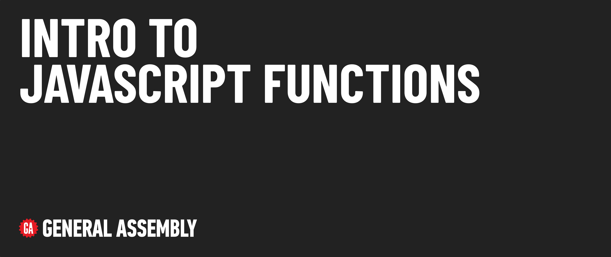

# Intro to JavaScript Functions

## Module overview

This module introduces functions in JavaScript.

## Content outline

| Lesson | Video Time | Video | Learning Objectives |
| ------ |:----------:|:-----:| ------------------- |
| [Setup](./setup/README.md)                                        | tktk min | [tktk Link]() | ---                                                                                                   |
| [Concepts](./concepts/README.md)                                  | tktk min | [tktk Link]() | Clearly define the concept and significance of functions in JavaScript.                               |
| [Fundamentals](./fundamentals/README.md)                          | tktk min | [tktk Link]() | Compose function declarations and function expressions with appropriate syntax and naming convention. |
| [Parameters and Arguments](./parameters-and-arguments/README.md)  | tktk min | [tktk Link]() | Declare a function with parameters and call a function with arguments.                                |
| [Return Values](./return-values/README.md)                        | tktk min | [tktk Link]() | Work with functions that return data.                                                                 |
| [Expressions and Scope](./declaration-expression-scope/README.md) | tktk min | [tktk Link]() | Understand and work with function scope.                                                              |
| [Arrow Function Expressions](./arrow-functions/README.md)         | tktk min | [tktk Link]() | Compose functions using arrow function syntax.                                                        | 
|  **Total Module**                                                 | tktk min | --            | ---                                                                                                   |

## Additional content 

📖 [Reference Materials](./references/README.md)

### 🚀 Level Up

- [Functions as Arguments](./level-up/functions-as-arguments.md) 
- [Fewer Arguments than Parameters Defined](./level-up/fewer-arguments.md)
- [Rest Parameters](./level-up/rest-parameters) 
- [Extra Arguments than Parameters Defined](./level-up/extra-arguments.md) 
- [Immediately Invoked Function Expressions](./level-up/iife.md) 
- [Nesting Functions](./level-up/nesting-functions.md) 

## Internal resources

✏️ [Instructor Guide](./internal-resources/instructor-guide.md)

🎥 [Video Hub](./internal-resources/video-guide/README.md)

🏗️ [Release Notes](./internal-resources/release-notes.md)

---

**Find a 👾 bug 👾 or have suggestions? [Let us know](https://ga.co/curriculum-feedback)!**
