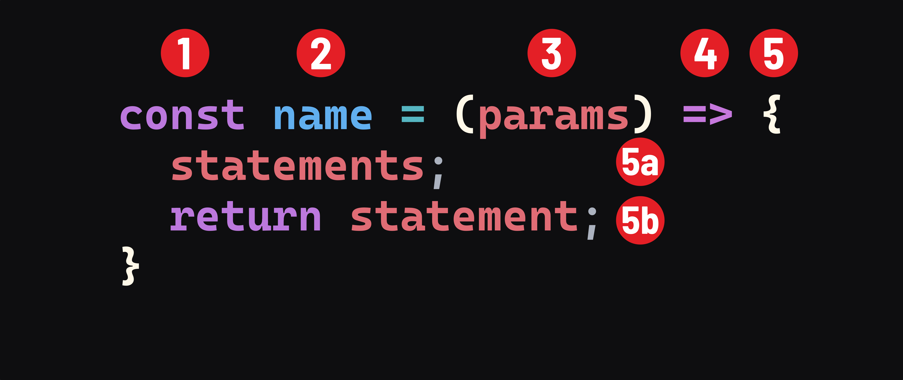

<h1>
  <span class="headline">Intro to JavaScript Functions</span>
  <span class="subhead">Arrow Functions</span>
</h1>

**Learning objective:** By the end of this lesson, students will be capable of converting traditional function expressions into arrow function expressions and explain the syntactical differences between the two.

## Syntax

Arrow function expression syntax is the most common and modern syntax. You'll see us use it more often than not.

The following function expression:

```javascript
const add = function(numA, numB) {
  return numA + numB;
}
```

is equivalent to the following function written as an arrow function expression:

```javascript
const add = (numA, numB) => {
  return numA + numB;
}
```

Arrow function expressions offer a more concise syntax compared to function expressions while using many of the same patterns. We can leave off the function keyword entirely when composing them. Here's a breakdown:



1. The `const` keyword. `const` should be used whenever a function expression is assigned to a variable.
2. The name of the function.
3. Comma-separated parameters. Note that if there are no parameters, the `()` is required.
4. The arrow: `=>`. Note that this replaces the `function` keyword. This is the only required syntax change between function expressions and arrow function expressions.   
5. The body of the function is indicated by curly braces. 
   - 5a. The statements that make up the function itself.
   - 5b. Optionally, a `return` statement.


## 🎓 You Do

Let's practice using this new syntax by converting a function declaration into an arrow function expression.

1. Take a look at the following function that squares a number:

   ```javascript
   function square(num) {
     return num * num;
   }
   ```

2. Convert this function into an arrow function expression.

## ❓ Review questions

### Given this code:

```javascript
const sumTwoNumbers = (numA, numB) => {
  return numA + numB;
}

const sum = sumTwoNumbers(5, 10);
```

1. What is the job of the `sumTwoNumbers` function?
2. Is `numA` a parameter or an argument?
3. What will the value of `numA` be inside the `sumTwoNumbers` function?
4. Will `numA` have a value outside of the `sumTwoNumbers` function? If it does, what will it be?
5. What data type will the value returned from the `sumTwoNumbers` function be?
6. What will be returned from the `sumTwoNumbers` function?
7. What would print to the console if we logged `sum` after the final line?
8. How many arguments are passed to the `sumTwoNumbers` function? What are they?
9. How many parameters does the `sumTwoNumbers` function accept? What are they?

### Given this code:

```javascript
const emphasize = (str) => {
  return `${str} ${str}!`;
}

emphasize('really');
```

1. What does the `emphasize` function do?
2. What will the value of `str` be inside of the `emphasize` function?
3. What data type will the value returned from the `emphasize` function be?
4. Will what is returned from the `emphasize` function be usable later in this program? If not, how could we make it so that it is?
5. How could we make it so that what is returned from the `emphasize` function is shown in the console?
6. How many arguments are passed to the `emphasize` function? What are they?
7. How many parameters does the `emphasize` function accept? What are they?
