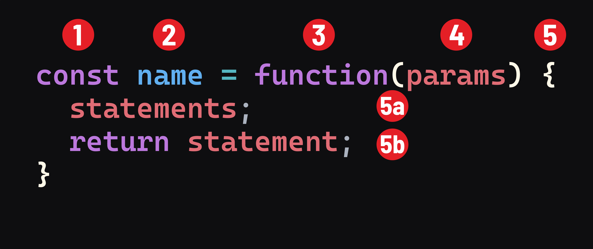

<h1>
  <span class="headline">Intro to JavaScript Functions</span>
  <span class="subhead">Expressions</span>
</h1>

**Learning objective:** By the end of this lesson, students will be able to differentiate between function declarations and function expressions, and apply function expressions in code using anonymous functions. 

## Syntax

So far, we've mostly covered function declarations, but you should be aware of another syntax for writing a function: function expressions. 

To get a sense of how they're different, let's look at an example function declaration: 

```javascript
function add(numA, numB){
  return numA + numB;
}
```

The same function, as a function expression, would look like this:

```javascript
const add = function(numA, numB) {
  return numA + numB;
}
```

Here's a syntax breakdown of this:



1. The `const` keyword. `const` should be used whenever a function expression is assigned to a variable.
2. The name of the function.
3. The `function` keyword.
4. Comma-separated parameters.
5. The body of the function is indicated by curly braces. 
   - 5a. The statements that make up the function itself.
   - 5b. Optionally, a `return` statement.

Note how the code inside of the function doesn't change. The only alteration is the syntax on the first line. 

## Function expressions: assigning a function to a variable

At first glance, this may look complex, but there is a familiar element here. This is how we declare variables! Instead of assigning the variable to a string or a number, we're assigning it to a function.

Also, note the function itself has no name - function expressions allow us to omit the name and create what is known as an *anonymous function*. 

> 📚 An *anonymous function* is any function without a name. 

So, if the function doesn't have a name, how do we call it? We use the variable name!

```javascript
const add = function(a, b) {
  return a + b;
}

// called using the variable name:
add(4, 2);
```

