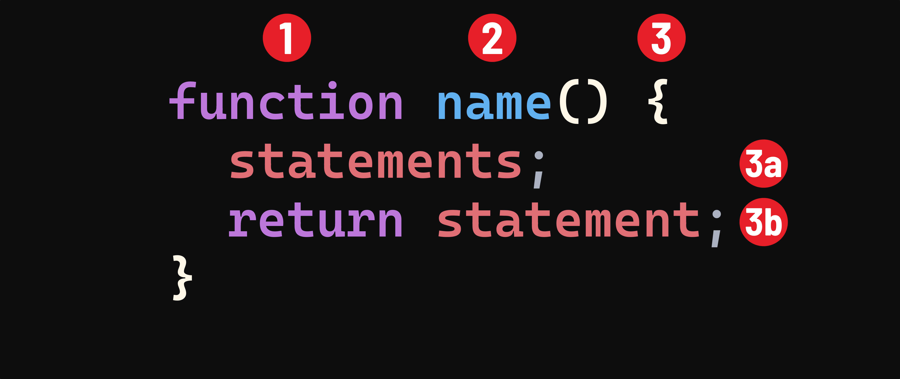

<h1>
  <span class="headline">Intro to JavaScript Functions</span>
  <span class="subhead">Fundamentals</span>
</h1>

**Learning objective:** By the end of this lesson, students will compose function declarations and function expressions with appropriate syntax and naming conventions.

## Function syntax

A function declaration will have the following syntax: 



1. The `function` keyword.
2. The name of the function.
3. The body of the function is indicated by curly braces. 
   - 3a. The statements that make up the function itself.
   - 3b. Optionally, a `return` statement.

## Declaring a function

A basic function declaration could look something like this:

```javascript
function printBanner() {
  console.log('=======================');
  console.log('Insert Banner Text Here');
  console.log('=======================');
}
```

Let's quickly revisit the syntax:

We start with the `function` keyword.

The name of our function is `printBanner` - it prints a banner! Functions do something, so we name them with words that indicate action (verbs). 

We want to pack as much information as possible into our function names without being overly wordy. Try to avoid function names like `getSalesDataAndLaborCostsAndMigrateToNewBudgetReportWithItemizedDates()` - sure, it's descriptive, but it's hard to read or recognize at a glance. Also, try to avoid a name like `getAllStuff()` - it's non-specific to the point of hiding what the function does. 

In the body of our function, we are logging three lines of text to the console. These would be our statements. 

> 🧠 A quick note on commenting functions:
> 
> Comments should explain ***why*** you chose to solve a task a certain way, typically not ***what*** the code is doing. If your code is unclear enough to require a comment, it is often best to rewrite it. Well-composed code should generally speak for itself.

## Calling a function

Defining a function ***does not*** execute it. 

A function must be called for it to run. 

If we wanted to call the `printBanner()` function from our previous example, we would do so like this:

```javascript
printBanner();
```

This text would be printed to the console:

```plain
=======================
Insert Banner Text Here
=======================
```

The beauty of functions is their reusability. If we wanted to log this text out twice, rather than having to type out each console log again, we can call the function twice: 

```javascript
printBanner();
printBanner();
```

To get the output: 
```
=======================
Insert Banner Text Here
=======================
=======================
Insert Banner Text Here
=======================
```

> 🧠 Developers might say call, execute, invoke, or run a function. In the context of functions, these are synonyms.

Recap: 

```javascript
// We define a function to do something:
function sayHello(){
  console.log('Hello!');
}

// And then elsewhere in our code, we call the function to run it:
sayHello();
```
