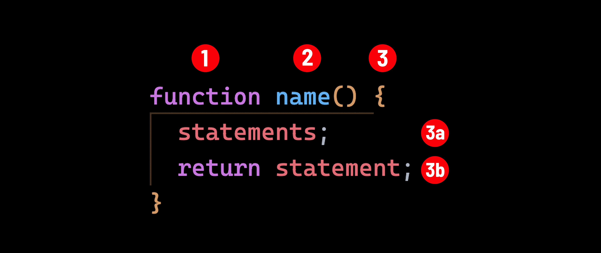

# Intro to JS Functions - Fundamentals


**Learning objective:** By the end of this lesson, students will understand the basic syntax required to create function declarations, and how to invoke a function.

## Function Syntax

A basic function declaration will have the following syntax: 





1. The `function` keyword.
2. The name of the function.
3. The body of the function, indicated by curly braces. 
<br>
&nbsp; a. The statements that make up the function itself.
<br>
&nbsp; b. Optionally, a return statement.


## Declaring a Function

A basic function declaration looks something like this:

```javascript
function printBanner() {
  console.log('=======================');
  console.log('Insert Banner Text Here');
  console.log('=======================');
}
```

Let's quickly revisit the syntax:

We start with the `function` keyword.

The name of our function is `printBanner` - it prints a banner! Functions do something, so we name them with doing words. We want to pack as much information as possible into our function names, without being overly wordy. Try to avoid function names like `getSalesDataAndLaborCostsAndMigrateToNewBudgetReportWithItemizedDates()` - sure, it's descriptive, but it's hard to read or recognize at a glance. Also try to avoid a name like `getAllStuff()` - it's non-specific to the point of hiding what the function really does. 

In the body of our function we are logging three lines of text to the console. These would be our statements. 

> 📚 A quick note on commenting functions: 
> comments should explain _why_ you chose to solve a task a certain way, not _what_ the code itself is doing. If your code is unclear enough that it requires a comment, it is often best to rewrite the code. Your code should speak for itself, if well-composed. 

## Calling a Function

Defining a function **does not** execute it. 
In order to run a function, a function must be called. 

If we wanted to call the `printBanner()` function from our previous example, we would do so like this:

```javascript
printBanner();
```

The console would then log: 
```
=======================
Insert Banner Text Here
=======================
```

The beauty of functions is their reusability. Now, if we wanted to log this text out twice, rather than having to type out each console log again, we can simply call the function twice: 

```javascript
printBanner();
printBanner();
```

To get the output: 
```
=======================
Insert Banner Text Here
=======================
=======================
Insert Banner Text Here
=======================
```

> 🧠 Developers might say call, execute, invoke, or run a function. In the context of functions, these are synonyms.

Recap: 

```javascript
// We define a function to do something
function sayHello(){
  console.log('Hello!');
}

// And then elsewhere in our code we call the function to run it
sayHello(); // console logs: Hello!
```


