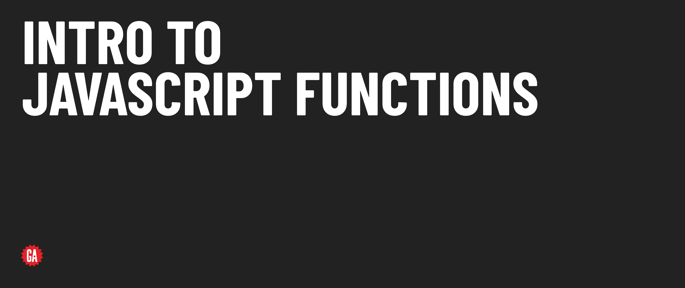

# Intro to JavaScript Functions - Release Notes

## Version 1.0 - Updates from legacy content

This release modularizes the legacy Intro to JavaScript Functions lecture and provides some other minor updates detailed below. Updates are provided here at the module level, but all subsequent updates should be documented at the lesson level.

### Release details

**Additions**

Microlesson on Return Values

**Changes**

General restructuring of content - Basic Syntax covers Function Declarations only, introduces Parameters and Args. 
Moves Default Parameters to core lesson, under Parameters and Arguments

**Removals**

Practice Exercises - You Do's
Requirement to know arrays and array methods to follow examples
