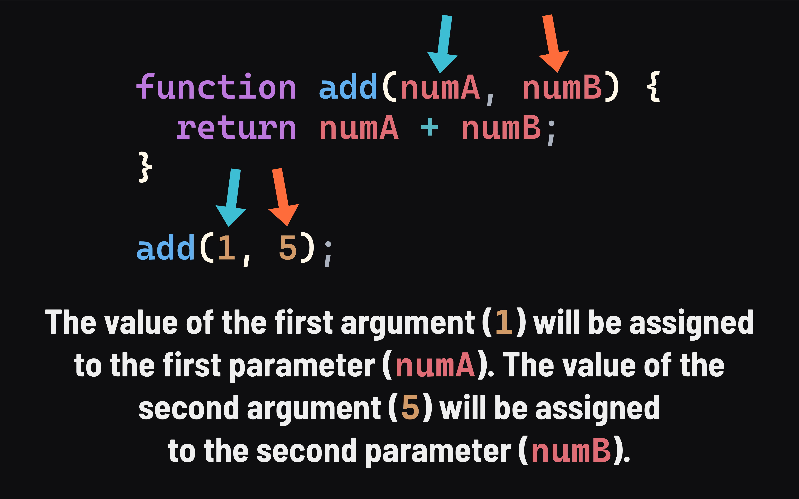

<h1>
  <span class="headline">Intro to JavaScript Functions</span>
  <span class="subhead">Parameters and Arguments</span>
</h1>

**Learning objective:** By the end of this lesson, students will be able to declare a function with parameters and call a function using arguments.

## Defining parameters and arguments

In the examples so far, seeing why functions are so helpful may be difficult. It's nice not to have console.logs over and over, but if a function always produces the same result, the usefulness is limited, right? 

Functions are designed to take data input. You might have been wondering why we had an empty set of parentheses in the basic syntax example from earlier: 

```javascript
function name() {
  statements;
  return statement;
}
```

When writing a function, we can define placeholders to accept data that will be input to our function, and these placeholders are known as *parameters*.

A more complete example of basic function syntax would include parameters like so: 

```javascript
function name(parameter1, parameter2, ...parameterN) {
  statements;
  return statement;
}
```

> 📚 *Parameters* are the named variables listed in a function's definition that serve as placeholders for the values that will be passed to the function when it is called. 
> 
> Parameters act like local variables within a function and can act as placeholders for any data. 

Let's add a `name` parameter to our `sayHello()` function and make use of it in the function body: 

```javascript
function sayHello(name) {
  console.log(`Hello ${name}`);
}
```

We want this function to accept a name value as input and log out `'Hello'` along with whatever `name` is. When we define this function, we have no way of knowing what name it will be, but that's okay - remember that parameters are placeholders! 

Now that we've added a `name` parameter, we can use it like a normal variable. However, right now `name` is undefined. How do we assign a value to `name`?

When we called our function earlier, we also had empty parentheses following the name: 

```javascript
sayHello();
```

Similarly to how we define parameters when creating a function, we can also pass values to a function when we call them. These values are known as *arguments*. 

> 📚 *Arguments* are the values supplied to a function when called, which are then assigned to the corresponding parameters within the function.

When we call the `sayHello()` function, we can supply any name (as a string value) as an argument: 

```javascript
sayHello('Jim');   
// Prints: 'Hello Jim'
sayHello('Emily'); 
// Prints: 'Hello Emily'
sayHello('Joe');   
// Prints: 'Hello Joe'
```

This argument corresponds to the `name` parameter in our function, and suddenly, `name` is no longer undefined. It's now defined with whatever value we supplied as an argument.


Just like that, our function is dynamic! Rather than regurgitating the same information each time it's invoked, it now changes based on the argument supplied to it.

Finally, let's return briefly to our `printBanner()` example to give it a bit more purpose: 

```javascript
function printBanner(text) {
  console.log('========================');
  console.log(text);
  console.log('========================');
}

printBanner('We can make this banner say anything!');

// Prints:
// ========================
// We can make this banner say anything!
// ========================
```

We can even pass variables to functions:

```javascript
const phrase = 'say anything!';

printBanner(phrase);

// Prints:
// ========================
// say anything!
// ========================
```


## How to declare a function with multiple parameters

A function can take up to 255 parameters. When defining a function, parameters are added between parentheses and are comma-separated.

Let's declare a new function: 

```javascript
function add(numA, numB) {
  return numA + numB;
}
```

Try to name your parameters sensibly to avoid confusion, and be mindful of the data types that are passed in. This function is designed to take in two integers as input. In this example, `numA` and `numB` act as placeholders for whatever integers are passed into the function when called. Let's do that now:

```javascript
add(1, 5);
```

Arguments are assigned to parameters positionally, which means the order of parameters and arguments matters. The first argument passed to a function will align with the first parameter. The second argument will align with the second parameter, and so forth.



This mnemonic device may help you remember the difference between an argument and a parameter:
- ***A***rguments are the ***A***ctual value passed to a function.
- ***P***arameters are a ***P***laceholder. 

Parameters become local variables inside the function body. They are only accessible inside the function in which they are defined. Just like when naming variables and functions, it's vital to name parameters using identifiers representative of the data they will hold. 

## ❓ Review questions 

- What's the difference between an *argument* and a *parameter*?

- Explain how *arguments* and *parameters* are matched up.

- Given this code:

  ```javascript
  function add(numA, numB) {
    return numA + numB;
  }

  add(1, 5);
  ```
  
  Will anything be logged to the console? Why or why not?

## 🎓 You Do

Write a function named `planetHasWater`.

It will have one parameter: `planet`.

Print `true` to the console if the `planet` argument is either `'Earth'` or `'Mars'`; otherwise, log `false`.

Invoke the function a few times to test it:

```javascript
planetHasWater('Earth');   // should print true
planetHasWater('Venus');   // should print false
planetHasWater('Mars');    // should print true
planetHasWater('Jupiter'); // should print false
```
