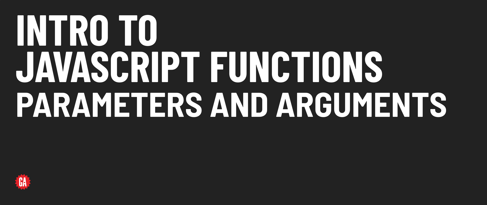
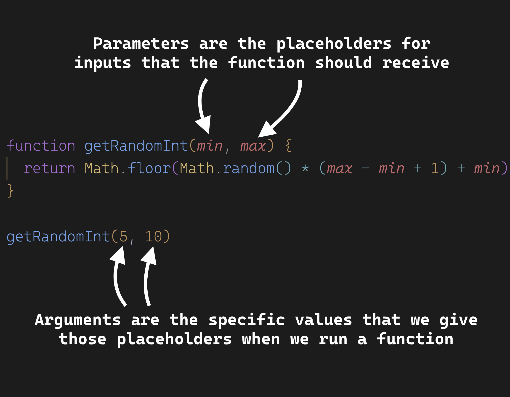

# Intro to JavaScript Functions - Parameters and Arguments



**Learning objective:** By the end of this lesson, students will be able to declare a function with parameters, call a function with arguments, and apply default parameters. 

## Defining Parameters and Arguments

Given the current examples, it can be hard to see why functions are so helpful. Certainly it's nice to not have to type console.logs over and over, but if the function is always producing the same result, the usefulness is limited, right? 

The key thing to understand is that functions are designed to take data input. You might have been wondering why we had an empty set of parentheses in the basic syntax example from earlier: 

```javascript
function name() {
  statements;
  return statement;
}
```

When writing a function, we can define "placeholders" to accept data that will be input to our function, and these placeholders are known as _parameters_.
A more complete example of basic function syntax would include parameters, like so: 

```javascript
function name(parameter1, parameter2, ...parameterN) {
  statements;
  return statement;
}
```

> 📚 Parameters are the named variables listed in a function's definition that serve as placeholders for the values that will be passed to the function when it is called. Parameters act like local variables within a function, and can act as placeholders for any kind of data. 

Let's look at a slightly refactored version of our `sayHello()` function: 

```javascript
function sayHello(name){
  console.log('Hello ' + name);
}
```

What we want this function to do is accept a name as input, and log out `Hello` plus whatever the name is. When we define this function, we have no way of knowing what name it will be, but that's ok - remember that parameters are placeholders! 

Now that we've added a `name` parameter, we can use it just like a normal variable. We'll log it in the console, concatenated with a basic greeting. Remember, functions don't run until we call them, so it's ok that `name` is undefined when we are declaring the function.

Now the fun part. Note that when we called our function earlier, we also had empty parentheses following the name: 

```javascript
sayHello();
```

In a similar process to how we define parameters when creating a function, we can also pass values to a function when we call them. These values are known as arguments. 

> 📚 Arguments are the values supplied to a function when it is called, which are then assigned to the corresponding parameters within the function.

When we call the `sayHello()` function, we can supply any name (as a string value) as an argument: 

```javascript
sayHello('Jim');   // logs: Hello Jim
sayHello('Emily'); // logs: Hello Emily
sayHello('Joe');   // logs: Hello Joe
```

This argument corresponds to the `name` parameter in our function, and suddenly `name` is no longer undefined - instead it's now defined with whatever value we supplied as an argument.

Just like that, our function is dynamic! Rather than simply regurgitating the exact same information each time it's invoked, it now changes based on the argument supplied to it. 

<br>

Finally, let's return briefly to our `printBanner()` example to give it a bit more purpose: 

```javascript
function printBanner(text) {
  console.log('========================');
  console.log(text);
  console.log('========================');
}

printBanner('We can make this banner say anything!');
printBanner('Huzzah!');

// ========================
// We can make this banner say anything!
// ========================
// ========================
// Huzzah! 
// ========================
```

## How to declare a function with parameters

A function can take any number of parameters (from 0 to 255). When defining a function, parameters are added between parentheses and are comma-separated.

Let's declare a new function: 

```javascript
function addOne(num) {
  return num + 1
}
```

This function is designed to take in a single integer as input. In this example, `num` acts a placeholder for whatever integer might be passed into the function when it is called.

Try to name your parameters sensibly to avoid confusion, and be mindful of the data types that are passed in. 

Let's look at an example with multiple parameters:



Arguments are assigned to parameters positionally, which is to say the order of parameters and arguments matter. The first argument passed to a function will line up with the first parameter, the second argument will line up with the second parameter, and so forth. 

Parameters become local variables inside the function body, and are only accessible inside the function in which they are defined. Just like when naming variables and functions, it’s vital to name parameters using identifiers that are representative of the data they will hold. 

## Calling a function with arguments

Let's return to the `addOne` function. We would invoke the function like this: 

```javascript
addOne(3) // returns 4
```
Whatever number is supplied to the function when we call it will be passed to the function as `num`. As our function is designed to increment this number by 1, invoking `addOne(3)` returns the number 4.

Changing the argument will likewise change the result:

```javascript
addOne(99) // returns 100
```

Looking at the `add` function we defined earlier:
```javascript
function add(numA, numB, numC){
  return numA + numB + numC
}
```

We could call the function like so:

```javascript
add(1, 5, 10) // returns 16
```

or

```javascript
add(1, 1, 1) // returns 3
```


## Default parameters

What if your function requires certain arguments, and you want to provide a default value for the parameter if an argument is not supplied when the function is invoked?

No problem - JavaScript has the option to specify default parameters. By specifying a default, `name` will always equal 'friend' unless an argument is supplied! This overrides the default behavior of `name` being `undefined` unless passed an argument.

```javascript
function sayHi(name = 'friend'){
  console.log('Hi ' + name + '!')
}
```

```javascript
sayHi() // logs 'Hi friend!'
```

```javascript
sayHi('Joe') // logs 'Hi Joe!'
```

Any expression can be provided as a default, including objects, functions, etc.


# Parameter/argument - Review Questions ❓

**❓ What’s the difference between an *argument* and a *parameter*?**

**❓ Explain how *arguments* and *parameters* are “matched up”.**


## 🧠 You Do: 

Write a function named `planetHasWater`.

It will have one parameter: `planet`.

Log `true` to the console if the `planet` argument is either “Earth” or “Mars”, otherwise log `false`.

Invoke the function a few times to test it:

```javascript
planetHasWater('Earth')   // should log true
planetHasWater('Venus')   // should log false
planetHasWater('Mars')    // should log true
planetHasWater('Jupiter') // should log false
```

