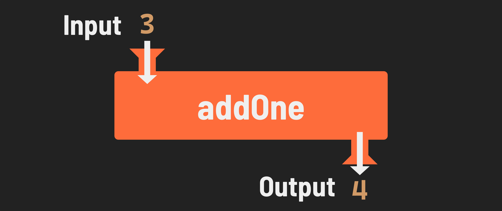

<h1>
  <span class="headline">Intro to JavaScript Functions</span>
  <span class="subhead">Return Values</span>
</h1>

**Learning objective:** By the end of this lesson, students will be able to return data from functions using the `return` statement.

## What is a return value?

A return value is the output of a function. In other words, it is what a function gives back after it does its job.

If a function does not explicitly return a value, it defaults to returning `undefined`. This means the function has not been instructed to supply a result.

Often, you may want to use the result of a function for further operations. In such cases, the `return` statement is used to specify what value a function should output.

## The `return` statement

Use the `return` keyword to return a value from a function.

The `return` keyword can only be used inside of functions. When used, it stops the execution of the function, and the function then evaluates to the return value. 

Let's look at some examples: 

```javascript
function addOne(num){
  return num + 1;
}

console.log(addOne(3));
// Prints: 4
```

The above works as expected! We are returning the result of adding `num` and `1`. Here's a simplified version of this, similar to what you saw in the Concepts section:



```javascript
function addOne(num){
  return 'this is some text';
  return num + 1;
}

console.log(addOne(3)); 
// Prints: 'this is some text'
```

Above, the first `return` statement blocks the remainder of the code from running! The function stops executing when the first `return` statement is reached.

```javascript
function addOne(num){
  num + 1;
  return;
}

console.log(addOne(3)); 
// Prints: undefined
```

Finally, we can see that returning without an expression defaults to `undefined`. 

This is also the case when we omit the `return` statement entirely, as mentioned earlier:

```javascript
function addOne(num){
  num + 1;
}

console.log(addOne(3)); 
// Prints: undefined
```

## Storing and using the return value of a function

It is often useful to store the return value of a function. We can assign the return value of a function to a variable, just like any other value. 

For instance, if we wanted to store the value of invoking `addOne()` and passing in 3 as an argument, we could do something like this: 

```javascript
function addOne(num){
  return num + 1;
}

// addOne(3) evaluates to 4
const incrementedNum = addOne(3);
// incremetedNum is 4

console.log(incrementedNum); 
// Prints: 4
```

## Bringing it all together

For a more involved example, let's imagine we have a shopping cart that needs to calculate tax when the user is checking out. We can use a `calculateTax()` function to figure out the amount of tax due, then store the return value of that function in the variable `taxAmount` to do further calculations: 

```javascript
function calculateTax(subtotal){
  // calculate a flat tax of 7%
  const taxDue = subtotal * (7 / 100);
  return taxDue;
}

function calculateTotal(){
  // normally, cartValue would be calculated elsewhere
  // we're hard coding it to simplify this example
  const cartValue = 45;
  // remember that we can pass variables like cartValue to functions

  // store the return value of the calculateTax function
  const taxAmount = calculateTax(cartValue);

  // we can return the cart total plus the required tax
  return cartValue + taxAmount;
}

console.log(calculateTotal()); 
// Prints: 48.15
```

The ability to store and use return values allows us to use *helper functions*, like `calculateTax` above, to keep our code concise and legible.

> 📚 *Helper functions* are functions that perform a part of the calculations of another function - `calculateTax()` above is a great example. 

Breaking up the tasks of a larger function into smaller helper functions can make it much easier to understand what a function as a whole is doing. 

Another example is below. Don't get caught up in the amount of code here or the specifics of what each one of these helper functions would do. Focus on the big picture. 

Note how the `compileAndSend` function's job is only to compile a report and send it. The helper functions that we've defined would handle the heavy lifting of that task. Because this code delegates its tasks to these smaller helper functions, it is easier to read at a high level.

```javascript 
function compileAndSend() {
  const sales = getSalesData();
  const labor = getLaborCosts();
  const budget = getBudget();
  const report = generateReport(sales, labor, budget);
  sendReport(report);
}

// Run the function
compileAndSend();

/*--- helper functions ---*/

function getSalesData() {
  // code to calculate sales
  return sales;
}

function getLaborCosts() {
  // code to calculate labor costs
  return labor;
}

function getBudget() {
  // code to calculate budget
  return budget;
}

function generateReport(sales, labor, budget) {
  // code to generate report
  return report;
}

function sendReport(report) {
  // code to send the report somewhere
}
```

Despite `compileAndSend` being quite a large function with a lot of code, the helper functions make it reasonable to follow. We're getting the sales data, labor costs, and the budget. Then, we're compiling that data into a report, and sending it somewhere. 

All of this is possible because we're storing the return values of each of these helper functions!

## 🎓 You Do

Write a function named `computeArea`.

It will have two parameters: `width` and `height`.

It will compute the area of a rectangle (*width* * *height*) and return a string in the following form:

> The area of a rectangle with a width of ___ and a height of ___ is ___ square units.

Invoke the function to test it:

```javascript
console.log(computeArea(5, 25));
// Prints: 
// The area of a rectangle with a width of 5 
// and a height of 25 is 125 square units.
```
